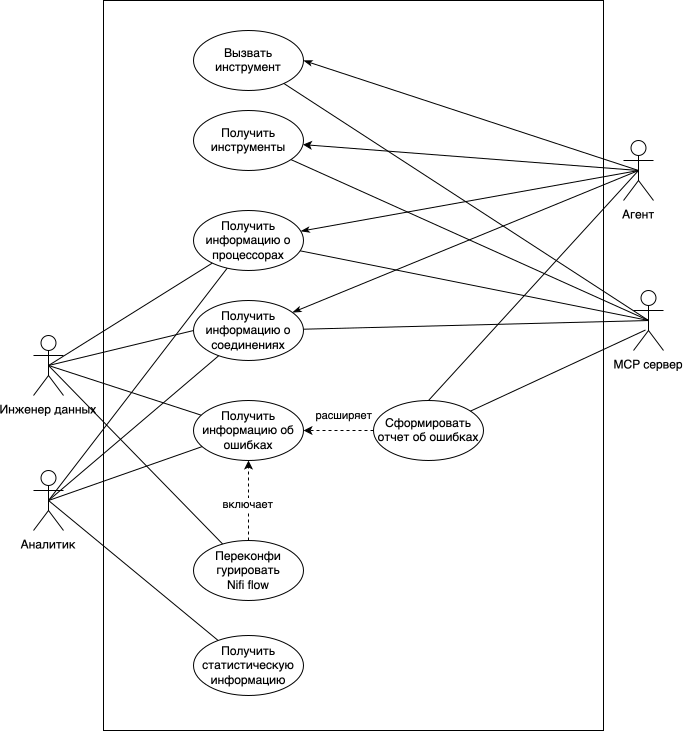
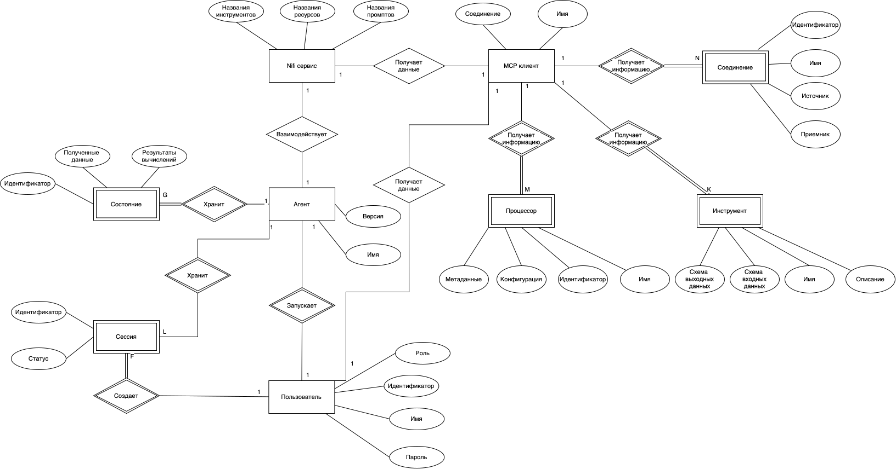
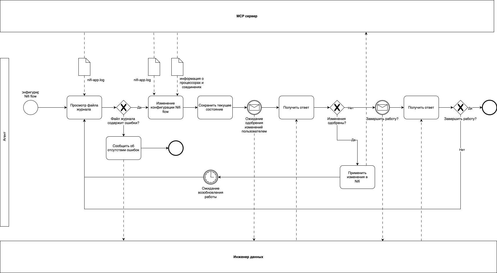

# Nifi guard

**Идея проекта**

Разработка сервиса мониторинга _Apache Nifi_. Агент, под управлением большой языковой модели, который на основе информации из файла журнала должен выполнить
переконфигурацию _Nifi flow_, восстановить его корректную работу. Должны быть реализованы методы для получения информации о состоянии системы.

---

**Предметная область**

ETL—инструменты предназначены для получения, преобразования данных из источников и их загрузки в целевую систему.
*Apache Nifi* состоит из следующих компонент:
* *FlowFiles* — потоки файлов, содержащие метаинформацию и данные, обрабатываемые процессорами;
* *FlowFileProcessor* — функции с входными и выходными параметрами;
* *Connections* — соединения, задающие направление движения потоков файлов между процессорами.

Сервис мониторинга ETL—процессов должен обладать следующими возможностями:
* выявления некорректно сконфигурированных процессоров;
* определения наличия ненастроенных соединений между процессорами;
* выявления ошибок, возникающих во время выполнения;
* устранения ошибок для восстановления корректной работы.

---

**Анализ существующих решений**

**Data Flow Manager** — сервис контроля конфигурации *Apache NiFi*. Агенты, использующие структуру, зависимости и соединения процессоров, выполняют валидацию ETL-процесса перед его запуском, рекомендуют или автоматически применяют изменения, восстанавливающие корректную работу.

**MonitoFi** — сервис мониторинга *Apache NiFi*. При возникновении ошибок информация о них сохраняется локально в *InfluxDB* или *Azure*, уведомление пользователя производится через сервис визуализации *Grafana* на электронную почту.

---

**Сравнение сервисов мониторинга ETL-процессов**

В таблице ниже представлены результаты сравнения сервисов мониторинга. Ни одно из существующих решений не обеспечивает устранение ошибок для восстановления корректной работы ETL-процессов во время их выполнения.

| Сервис / Критерий | Выявление ошибок в конфигурации процессоров | Определение наличия ненастроенных соединений | Выявление ошибок выполнения | Устранение ошибок выполнения |
| :--- | :---: | :---: | :---: | :---: |
| **MonitoFi** | + | + | + | - |
| **Data Flow Manager** | + | + | + | - |

---

**Актуальность**

При разработке и выполнении ETL—процессов в _Apache Nifi_ возникают ошибки, требующие устранения, так как их появление приводит к некорректной работе всей системы, получению неконсистентных, устаревших данных.
Ни одно из существующих решений не обеспечивает устранение ошибок во время выполнения _Nifi flow_. 

---

**Акторы**

* Агент - выполняет изменение конфигурации _Nifi flow_, формирует отчет об ошибках;
* Mcp Server - предоставляет инструменты и данные, взаимодействует с _Apache Nifi_;
* Data Engineer - запрашивает изменение конфигурации, получает информацию о состоянии системы;
* Аналитик - получает сведения о состоянии системы, нобходимые данные для визуализации;

---

**Use-Case диаграмма**

**ER диаграмма сущностей**

**Пользовательские сценарии**

Инженер данных может подключиться к системе и выполнить следующие действия:
* Получить информацию о процессорах в *Nifi flow*. Сервис, отвечающий за _Nifi_ получит информацию из _MCP сервера_, взаимодействующего с _Apache Nifi_. Пользователю будет предоставлено полное описание процессоров.
* Получить информацию об ошибках в *Nifi flow*. Будет выполнен вызов агента, который через сервис, отвечающий за _Nifi_ получит информацию об ошибках из _MCP сервера_, взаимодействующего с _Apache Nifi_. Агент дополнит описание ошибок и сформирует предложения об их устранении. Пользователю будет предоставлен полный ответ агента.

Аналитик данных может подключиться к системе и выполнить следующие действия:
* Получить статистическую информацию о *Nifi flow*. Сервис, отвечающий за _Nifi_ получит информацию о состоянии очередей, времени работы процессоров из _MCP сервера_, взаимодействующего с _Apache Nifi_. Статистическая информация будет представлена пользователю.

**Бизнес процесс, выполнения переконфигурации Nifi flow**

